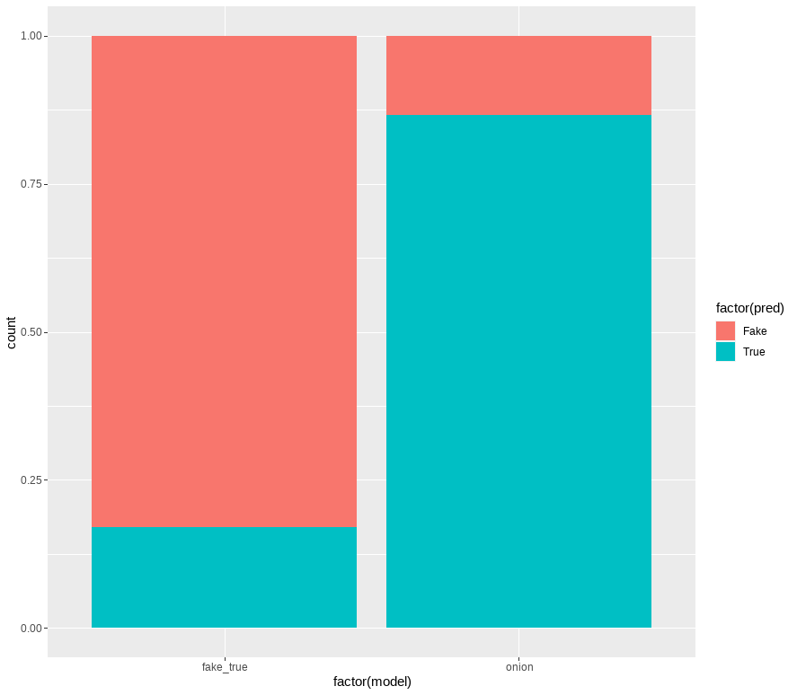
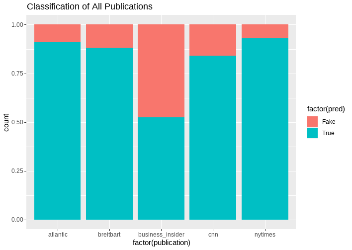
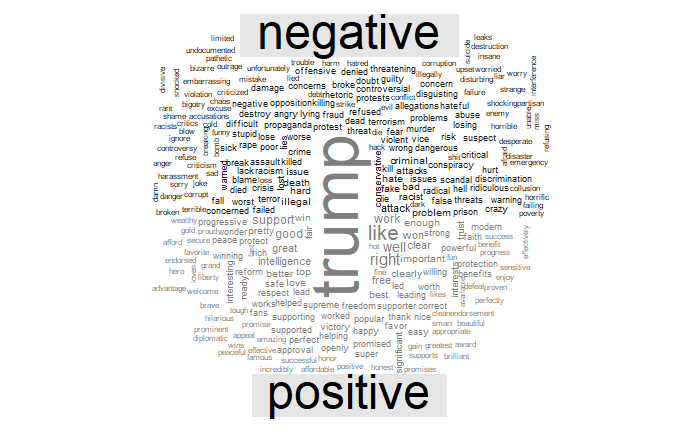
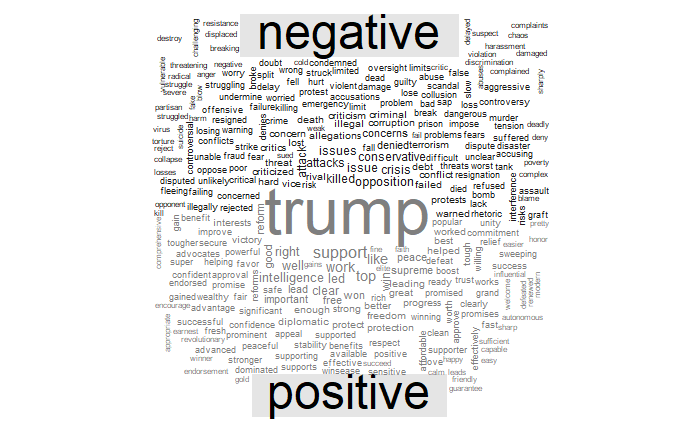

```{r setup, include=FALSE}
knitr::opts_chunk$set(echo = TRUE)

library(ggplot2)
library(emojifont)
library(here)
library(tidyverse)
library(tidyr)
library(tidytext)
library(kableExtra)
library(reshape2)
library(shiny)
library(datasets)
library(gridExtra)
```

# Fake News!
<insert image of quote>


Our project started with the seemingly innocuous proposal of creating an algorithm to identify real vs fake news, a classification that has had a lot of cache over the last half decade. Is it possible to create such an algorithm?

**Academic definition:**

"...“fake news” (are) news stories that are false: the story itself is fabricated, with no verifiable facts, sources or quotes." -University of Michigan Libraries.

**Cultural definition:**

In its current form, it is often used to identify political bias of the news source. This problem is exacerbated by news sources either implicitly or explicitly denying any bias, while butting up against the reality that even if what they report objectively happened and is verifiable, what they choose and choose not to report is a form of bias in itself. 

**In Summation:**

"Not only do different people have opposing views about the meaning of “fake news”, in practice the term undermines the intellectual values of democracy – and there is a real possibility that it means nothing. We would be better off if we stopped using it."-Chris Ratcliffe


In light of this, we have chosen the academic approach, and will try to build an algorithm that can identify news with verifiable fact versus misinformation.


# Data


We located a source from [Kaggle](https://www.kaggle.com/clmentbisaillon/fake-and-real-news-dataset?select=Fake.csv) where the author composed a dataset of news articles that have been identified as misinformation through fact check research, and a set of articles that have been verified as truthful.

[The Onion](https://www.theonion.com/latest):

We identified the satire website "The Onion" as a good source of misinformation, because it publishes comedy in the form of news satire. 

["All The News" Dataset](https://www.kaggle.com/snapcrack/all-the-news?select=articles1.csv):

We found a dataset on Kaggle that has 150,000 news articles from six major online publishers scraped from 2015 to 2017. 

\center  \center

```{r, echo=FALSE, warning=FALSE, eval=FALSE}
# use https://nycfuture.org/pdf/Creative_Infographic-final.pdf as reference 
# total number of datasets
# add sentiment analysis - true and fake tables and wordclouds
# use shiny to display tables side by side and wordclouds side by side

df <- data.frame(
    x = rep(seq(2, 15, 6.5), 2),
    y = c(rep(6.5, 3), rep(2,3)),
    h = rep(4.25, 6),
    w = rep(6.25, 6),
    value = c("150K",
             "5",
             "> 44K",
             "260+",
             "2",
             "+21"),
    info = c("News articles from Kaggle",
             "News outlets tested",
             "Classified news ISOT data",
             "Articles from the Onion",
             "True/Fake trained models",
             "Functions written"),
    shape = c(fontawesome(search_fontawesome("chart")),
              emoji("athletic_shoe")),
    font_family = c(rep("fontawesome-webfont", 5),
                    "EmojiOne"),
    color = factor(1:6)
)

ggplot(df, aes(x, y, height = h, width = w, label = info)) +
    geom_tile(aes(fill = color)) +
    geom_text(color = "white", fontface = "bold", size = 10,
              aes(label = value, x = x - 2.9, y = y + 1), hjust = 0) +
    geom_text(color = "white", fontface = "bold",
              aes(label = info, x = x - 2.9, y = y - 1), hjust = 0) +
    coord_fixed() +
    scale_fill_brewer(type = "qual",palette = "Dark2") +
    geom_text(size = 20, aes(label = shape, family = font_family,
                             x = x + 1.5, y = y + 0.5), alpha = 0.25) +
    theme_void() +
    guides(fill = FALSE) +
    labs(title = "Final Project At A Glance") +
    theme(plot.title = element_text(size = 28,hjust = 0.5))


#display words and count in separate tables
true_df_words_top %>%
  kable(align = 'clc', caption = "Top 10 'True' Words") %>%
  kable_styling(full_width = F, position = "float_left")

fake_df_words_top %>%
  kable(align = 'clc', caption = "Top 10 'Fake' Words") %>%
  kable_styling(full_width = F, position = "float_right")
```


# Tidying


We created several document term matrices (dtm) based on the different data sources we used to collect news articles. We then performed tidying to ensure that these dtms fit the format of the models.  

### Notable functions:

***?format_dtm()*** 

**Description** 

Format a document term matrix into the structure of another document term matrix. Removes columns from `input_df` not used in `reference_df`, then adds columns NOT in `input_df` that are present in `reference_df` and sets values to zero.

**Usage**

format_dtm(input_df, reference_df)

**Arguments**

`input_df`: the dtm to be modified 

`reference_df`: dtm

***

***?create_dtm_for_model()***

**Description**

Takes a source news data frame, creates a corpus and prepares it to be used with a trained model. 

**Usage**

create_dtm_for_model(source_csv, comparison_dtm, output_file)

**Arguments**

`source_csv`: source news data frame consisting of `doc_id` and `text`. 

`comparison_dtm`: csv file with the dtm used for model training 

`output_file`: resulting csv with a dtm that can be used to test with the model.


# Training a model


We used the randomForest() algorithm for classifying our data as real or fake news using a 70%/30% train/test segmentation.

We built one model off of the real/fake dataset from University of Victoria and a second with our "Onion" scrape as the 
misinformation classification and the UV "real" data.

### Confusion Matrix using the Fake/True model
```{r echo=FALSE, warning=FALSE, message=FALSE}
library(here)
library(tidyverse)
library(randomForest)
source(here("functions","draw_confusion_matrix.R"), local = knitr::knit_global())

# add confusion matrix as visual
df <- read_csv(here('data','csv','output_df.csv'))

#rename type column, get rid of doc it
df<-df%>%
  select(-docId)

df$DocType <- as.factor(df$DocType)

colnames(df) <- paste(colnames(df), 'c', sep="_")

#already randomly assigned true or fake to divide into train and test
#70% train
num_rows <- nrow(df)
first_rows <- round(num_rows*.70)
next_rows <- first_rows + 1

train<-df[1:first_rows,]
#30% test
test<-df[next_rows:num_rows,]

num_cols <- ncol(df)
#initialize randomForest class

ft_model <- randomForest(DocType_c~.,data=train,mtry=2,importance
                    =TRUE,proximity=TRUE)

pred <- predict(ft_model, newdata=test[-num_cols],type="class")

cm <- table(unlist(test[,num_cols]), unlist(pred))

c_matrix <- caret::confusionMatrix(unlist(pred), unlist(test[,num_cols]))
draw_confusion_matrix(c_matrix,"FAKE/TRUE MODEL")

```


### Confusion Matrix using The Onion dtm
```{r echo=FALSE, warning=FALSE, message=FALSE}
# the onion data
df <- read_csv(here('data','csv','onion_dtm_df.csv'))

#rename type column, get rid of doc it
df<-df%>%
  select(-docId)

df$DocType <- as.factor(df$DocType)

colnames(df) <- paste(colnames(df), 'c', sep="_")

#already randomly assigned true or fake to divide into train and test
#70% train
num_rows <- nrow(df)
first_rows <- round(num_rows*.70)
next_rows <- first_rows + 1

train<-df[1:first_rows,]
#30% test
test<-df[next_rows:num_rows,]

num_cols <- ncol(df)
#initialize randomForest class

on_model <- randomForest(DocType_c~.,data=train,mtry=2,importance
                    =TRUE,proximity=TRUE)

pred <- predict(on_model, newdata=test[-num_cols],type="class")

cm <- table(unlist(test[,num_cols]), unlist(pred))

c_matrix <- caret::confusionMatrix(unlist(pred), unlist(test[,num_cols]))
draw_confusion_matrix(c_matrix,"ONION MODEL")

```


# Analysis


***?perform_random_forest()***

**Description**

Trains a random forest model based on a document term matrix and applies that trained model to a second document term matrix to classify the data as Information ("True") or Misinformation ("Fake"). The function returns a predition dataframe. 

**Usage**

perform_random_forest(base_dtm, target_dtm)

**Arguments**

`base_dtm`: previously classified csv.

`target_dtm`: unclassified document term matrix on which to perform document analysis. 


# Exploratory Usage Of Our Models



*The Onion model appears to be working and confirms our prior expectations. We would not expect any news outlet to have a majority of its articles be misinformation.*



```{r warning=FALSE,message=FALSE, echo=FALSE}
library(caret)
# Save the variable importance values from our model object generated from caret.
x<-varImp(ft_model, scale = TRUE)

# Get the row names of the variable importance data
#rownames(x)

# Convert the variable importance data into a dataframe
importance <- data.frame(rownames(x), x$Fake)

# Relabel the data
names(importance)<-c('Word', 'Importance')
# Order the data from greatest importance to least important
importance <- transform(importance, Word = reorder(Word, Importance))

# Plot the data with ggplot.
ft_plot <- importance %>%
  top_n(20,Importance) %>%
  ggplot(aes(x=Word, y=Importance)) +
  geom_bar(stat = 'identity',colour = "blue", fill = "white") + coord_flip() +
  labs(title = "Importance Rank for Fake/True Model") +
  theme(plot.title = element_text(size = 20,hjust = 0.5))
```

```{r warning=FALSE,message=FALSE, echo=FALSE}
# Save the variable importance values from our model object generated from caret.
x<-varImp(on_model, scale = TRUE)

# Get the row names of the variable importance data
#rownames(x)

# Convert the variable importance data into a dataframe
on_importance <- data.frame(rownames(x), x$True)

# Relabel the data
names(on_importance)<-c('Word', 'Importance')
# Order the data from greatest importance to least important
on_importance <- transform(on_importance, Word = reorder(Word, Importance))

# Plot the data with ggplot.
on_plot <- on_importance %>%
  top_n(20,Importance) %>%
  ggplot(aes(x=Word, y=Importance)) +
  geom_bar(stat = 'identity',colour = "blue", fill = "white") + coord_flip() +
  labs(title = "Importance Rank for Onion Model") +
  theme(plot.title = element_text(size = 20,hjust = 0.5))

#side by side plots
grid.arrange(ft_plot, on_plot, ncol = 2)
```

# Exploring Data with Visualizations


We also did a sentiment analysis on the “fake” and “real” news datasets. We are not able to fact check the articles in this analysis to truly identify which articles are factually correct and which are truly “fake” news but we can analyze the use of positive words and negative words.   

For more visualization, take a look at this [rpubs](https://rpubs.com/ltcancel/viz_for_final_data607). 

  
```{r warning=FALSE,message=FALSE, echo=FALSE, eval=FALSE}
#load true and fake data into dataframes
true_df <-read.csv(here('data','csv','true_df.csv'), encoding="ascii", stringsAsFactors = FALSE)
fake_df <- read.csv(here('data','csv', 'fake_df.csv'), encoding="ascii", stringsAsFactors = FALSE)

#get all words from each article and remove stop words
true_df_words <- true_df %>%
  unnest_tokens(word,text) %>%
  anti_join(get_stopwords())

fake_df_words <- fake_df %>%
  unnest_tokens(word,text) %>%
  anti_join(get_stopwords())

#get top 10 words used for each group
fake_df_words_top <- fake_df_words %>%
  inner_join(get_sentiments("bing")) %>%
  count(word, sentiment) %>%
  top_n(10,n) %>%
  arrange(desc(n))

true_df_words_top <- true_df_words %>%
  inner_join(get_sentiments("bing")) %>%
  count(word, sentiment) %>%
  top_n(10, n) %>%
  arrange(desc(n))

```


```{r warning=FALSE,message=FALSE, echo=FALSE, eval=FALSE}
ui <- fluidPage(
  titlePanel(tags$strong("Top 10 Words")),
  
  verticalLayout(
    tags$h3("Fake News Words"),
    d3Output("fake"),
    tags$h3("True News Words"),
    d3Output("real")
  )
  
)

server <- function(input, output){
  output$fake <- renderD3(r2d3::r2d3(data=fake_df_words_top, script = "model_scripts/r2d3/d3_scripts.js", d3_version = "3", container = "div"))
  output$real <- renderD3(r2d3::r2d3(data=true_df_words_top, script = "model_scripts/r2d3/d3_scripts.js", d3_version = "3", container = "div"))

}


shinyApp(ui,server)

```

  
  
```{r warning=FALSE,message=FALSE, echo=FALSE, eval=FALSE}
r2d3::r2d3(data=fake_df_words_top, script = "model_scripts/r2d3/d3_scripts.js", d3_version = "3", container = "div")
```


```{r warning=FALSE,message=FALSE, echo=FALSE, eval=FALSE}
r2d3::r2d3(data=true_df_words_top, script = "model_scripts/r2d3/d3_scripts.js", d3_version = "3", container = "div")
```


# Conclusion

We successfully created a model from the test data we segmented. When we applied our models to data outside of the scope our training models, we were presented with a bunch of questions. 

-	When can you draw conclusions to unclassified data? 
-	We noticed that some of the articles that were classified as fake consisted of emotional or poetic language. For example, a music review was classified as misinformation. To what extent does emotional language throw off our models?  

When we tried to improve our model by removing variables that were not related to the content of the article, the accuracy in the test sets remained high but the outside of scope went haywire!

**Next Steps:**

1.	How can we train our models to deal with articles outside of scope?
2.	When can apply models outside of the scope?


# Sources


1. [Kaggle Fake and Real New Dataset](https://www.kaggle.com/clmentbisaillon/fake-and-real-news-dataset?select=Fake.csv)
2. [The Onion - Latest Articles](https://www.theonion.com/latest)
3. [Kaggle "All The News" Dataset](https://www.kaggle.com/snapcrack/all-the-news?select=articles1.csv)
4. [Random Forest In R](https://towardsdatascience.com/random-forest-in-r-f66adf80ec9)
5. [Fake News Detection Datasets](https://www.uvic.ca/engineering/ece/isot/datasets/fake-news/index.php)


